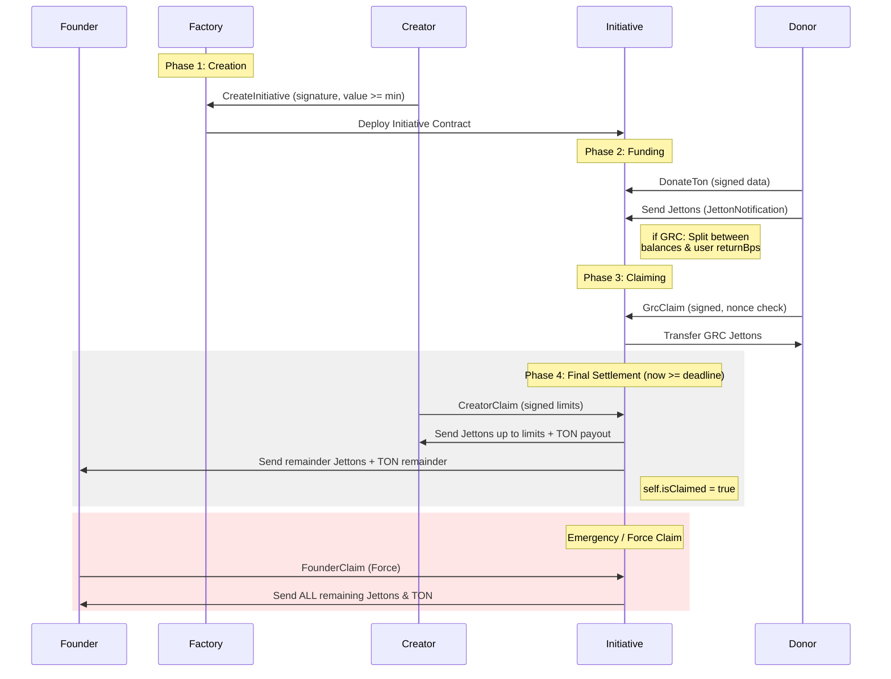

# 🪙 Grouche

**Grouche** is a decentralized fundraising and vesting system built on the **TON blockchain**.  
It allows **verified projects** (called _initiatives_) to receive donations in **TON** and multiple **Jetton tokens**, while automatically managing **refunds**, **payouts**, and **vesting schedules**.

All initiatives are deployed via a single **Factory contract**, which validates **Ed25519-signed** deployment requests from a trusted authority.

---

## 🧰 Development

```bash
# Build contracts
npx blueprint build

# Run tests
npx blueprint test

# Deploy or execute scripts
npx blueprint run

# Create new contract template
npx blueprint create ContractName
```

## 🪞 Example Lifecycle

