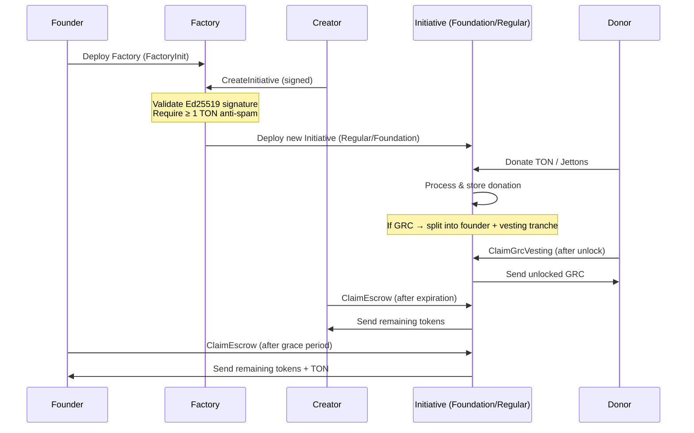

# 🪙 Grouche

**Grouche** is a decentralized fundraising and vesting system built on the **TON blockchain**.  
It allows **verified projects** (called _initiatives_) to receive donations in **TON** and multiple **Jetton tokens**, while automatically managing **refunds**, **payouts**, and **vesting schedules**.

All initiatives are deployed via a single **Factory contract**, which validates **Ed25519-signed** deployment requests from a trusted authority.

---

## 🧠 Overview

- Supports multiple Jetton currencies: **GRC, USDT, NOT, PX, DOGS**  
- Accepts both **TON** and **Jetton donations**

### Before expiration
- Donations go to the **initiative creator**
- **GRC tokens** are partially locked via vesting

### After expiration
- Donors receive **automatic refunds**
- Founders (or creators) can **claim remaining balances**
- Donors can **unlock their vested GRC**

### Initiative Types
| Type | Description |
|------|--------------|
| 🏛 **Foundation** | Full refund and vesting logic |
| ⚙️ **Regular** | Simplified, direct-payout fundraising |

---

## 🧩 Architecture

| Contract | Description |
|-----------|-------------|
| **Factory** | Deploys verified initiatives (Foundation / Regular) using Ed25519 signatures |
| **Foundation** | Advanced fundraising contract with vesting, refunds, and multi-Jetton support |
| **Regular** | Simplified fundraising contract with direct payouts and grace period for claims |
| **utils/** | Shared helpers: constants, messages, arrays, payload builders, jetton utils, vesting tiers |

---

## 🏗 Factory Contract

### Initialization — `FactoryInit (0xae37766f)`

| Field | Type | Description |
|--------|------|-------------|
| `pub` | `uint256` | Ed25519 authority public key |
| `*MinterAddress` | `Address` | Jetton minter addresses for each token |
| `*JettonWalletCode` | `Cell` | Jetton wallet code cells for deterministic wallet generation |

**Behavior**
- Sets `founder = sender()`
- Initializes all parameters

---

### Deploy Initiative — `CreateInitiative (0xbc7b9b61)`

| Field | Type | Description |
|--------|------|-------------|
| `signature` | `bytes64` | Ed25519 signature over signed data |
| `signedData` | `Slice` | Encoded payload containing initiative params |

**Process**
1. Requires at least `1 TON` for anti-spam (`context().value >= ton("1")`)
2. Verifies signature using `checkSignature()`
3. Parses:
   - `initiativeId: uint64`
   - `isRegular: bool`
   - `expiredAt: uint64`
4. Deploys:
   - **Regular** initiative if `isRegular == true`
   - **Foundation** initiative otherwise
5. Sends `0.05 TON` for deployment gas

---

### Withdraw — `Withdraw (0xc959163f)`

- Only founder can withdraw remaining TON balance  
- Keeps `GAS_RESERVE_TON` in contract  
- Adds comment `"Factory: withdraw"`

---

## 🧩 Foundation Contract

### Purpose
Handles complex fundraising logic:
- Refunds donations after expiration  
- Applies GRC vesting tiers  
- Allows donors to claim vested GRC  
- Founder claims unclaimed balances after expiry  

---

### Behavior Summary

| State | Action |
|--------|--------|
| **Before expiration** | TON and Jetton donations accepted |
| **After expiration** | Donations refunded automatically |
| **Vesting** | Donors claim vested GRC when unlocked |
| **Founder Claim** | After expiry, founder withdraws remaining Jettons and TON |

---

### Core Messages

#### 💎 DonateTon
- If expired → refunds TON donation immediately  
- If active → held and tracked for payout

#### 💠 JettonNotification
Handles incoming Jetton donations:
- If expired → refunds all Jettons back  
- If active →  
  - Adds amounts to balances (USDT, NOT, PX, DOGS)  
  - For **GRC**:
    - Reads vesting tier from payload  
    - Splits between founder and donor’s vesting  
    - Uses `grcTierToParams(tier)` for `lockDays` and `returnBps`

#### 🎁 ClaimGrcVesting
- Donor unlocks vested GRC once `now >= unlockAt`

#### 🧾 ClaimEscrow
- Founder can claim remaining Jettons & TON after expiration

---

### GRC Vesting Tiers

| Tier | Lock (days) | Return BPS | Return % |
|------|--------------|-------------|----------|
| 1 | 7 | 100 | 1% |
| 2 | 30 | 500 | 5% |
| 3 | 90 | 2000 | 20% |
| 4 | 180 | 4000 | 40% |
| 5 | 365 | 10000 | 100% |

Each vesting tranche:
```tact
GrcVestingTranche {
  amount: Int as coins;
  unlockAt: Int as uint64;
}
```

## ⚙️ Regular Contract

### Purpose
A simplified fundraising model for **short-term initiatives**.  
Funds are transferred directly to the **creator** or **founder** after expiration, depending on the grace period.

---

### Differences from Foundation

| Feature | Foundation | Regular |
|----------|-------------|----------|
| **Refunds** | Automatic for all donations | Only after expiry |
| **Founder claim** | Immediate after expiry | Delayed by grace period |
| **Creator claim** | No | Yes — before grace deadline |
| **Vesting** | Supported | Supported |
| **Donation handling** | Full | Simplified |

---

### Claim Escrow Logic

| Caller | Condition | Result |
|---------|------------|--------|
| **creator** | After expiration | Immediate payout |
| **founder** | After expiration + grace period | Payout to founder |
| **others** | Always rejected | Exit code `603` |

---

### Core Flow

1. Donors send TON or Jettons → stored in balances  
2. If expired → donations refunded automatically  
3. Creator can claim after `expiredAt`  
4. Founder can claim after `expiredAt + GRACE_PERIOD_DAYS`  
5. Donors claim vested GRC via `ClaimGrcVesting`

---

### 📊 Getters

| Method | Description |
|---------|-------------|
| `getBalances()` | Returns current Jetton balances |
| `getGrcVesting(address)` | Returns vesting tranches for donor |

## 🧰 Development

```bash
# Build contracts
npx blueprint build

# Run tests
npx blueprint test

# Deploy or execute scripts
npx blueprint run

# Create new contract template
npx blueprint create ContractName
```

## 🛡 Security & Validation

- **Ed25519 signatures** verify all deployments  
- **Anti-spam:** 1 TON required to create initiative  
- **Deterministic Jetton wallets** prevent fund misrouting  
- **Strict vesting validation** (index bounds, unlock times)  
- **Gas reserve protection** prevents depletion of balances  
- **Grace period** prevents early founder withdrawals  

---

## 🪞 Example Lifecycle


```mermaid
sequenceDiagram
    participant O as Founder
    participant F as Factory
    participant C as Creator
    participant I as Initiative (Foundation/Regular)
    participant A as Donor

    O->>F: Deploy Factory (FactoryInit)
    C->>F: CreateInitiative (signed)
    Note over F: Validate Ed25519 signature<br/>Require ≥ 1 TON anti-spam
    F->>I: Deploy new Initiative (Regular/Foundation)

    A->>I: Donate TON / Jettons
    I->>I: Process & store donation
    Note over I: If GRC → split into founder + vesting tranche

    A->>I: ClaimGrcVesting (after unlock)
    I->>A: Send unlocked GRC

    C->>I: ClaimEscrow (after expiration)
    I->>C: Send remaining tokens

    O->>I: ClaimEscrow (after grace period)
    I->>O: Send remaining tokens + TON
```

## 📜 Summary

| Component | Description |
|------------|-------------|
| **Factory** | Authorizes and deploys initiatives |
| **Foundation** | Full-featured contract with refunds & vesting |
| **Regular** | Lightweight fundraising contract |
| **utils/** | Common modules for payloads, arrays, vesting, etc. |
